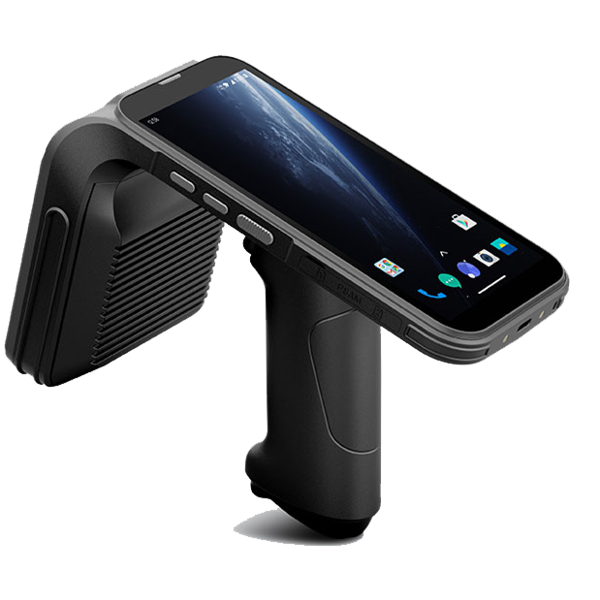
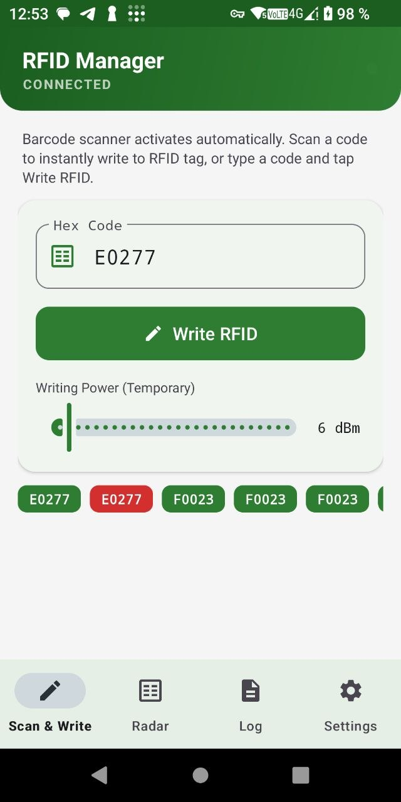
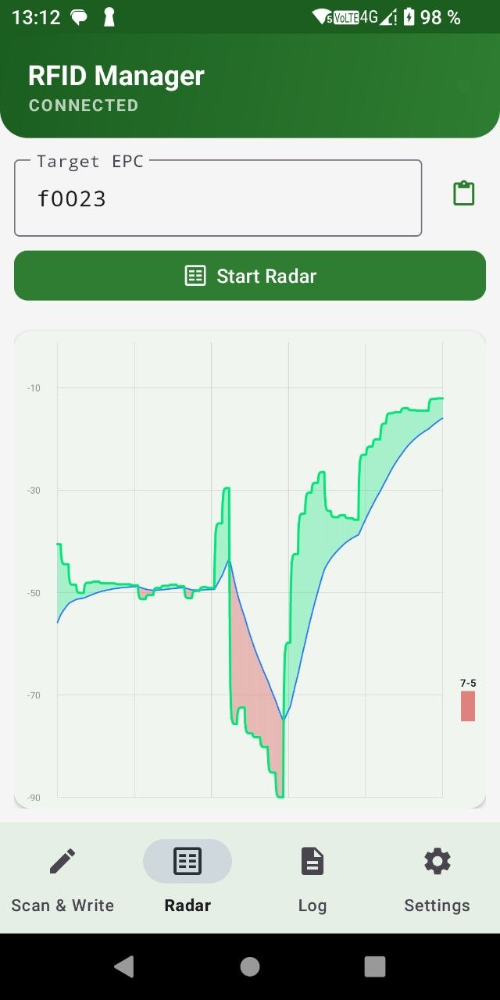

# RFID Manager (Chainway C5)

A professional Android application for managing UHF RFID tags, purpose-built for **Chainway C5** rugged handheld terminals. Designed for warehouse operators, pharmacy staff, and retail teams who need to deploy or locate RFID-tagged items quickly and reliably — without expensive dedicated hardware.

The app integrates directly with the C5's built-in UHF antenna and physical trigger button, enabling two core workflows:

**Tag Programming** — scan any QR or barcode with the physical trigger and the app instantly writes the decoded data into the RFID tag's EPC memory bank. No PC, no extra cables. One pull of the trigger programs a tag in under a second. Writing power is adjustable (5–30 dBm) to avoid accidentally overwriting neighboring tags. Every operation is logged in a live history strip — green for success, red for failure.

**Tag Search (Radar)** — enter a target EPC substring and the app guides you to its exact physical location among hundreds of tags. Transmission power adjusts dynamically as you move: high power at long range to acquire the signal, dropping automatically as you get closer to filter out reflections from neighboring tags. A full-screen EMA trend graph shows two lines — the raw current signal and a smoothed slow trend — with the area between them colored green (getting closer) or red (moving away). Audio feedback mirrors the graph: a positive tone in the green zone, a warning tone in the red, enabling completely eyes-free navigation in dense shelf environments.

 

## Key Features

### 1. Scan & Write (Programming)

This mode replaces expensive dedicated RFID printers when implementing RFID in small to medium-sized warehouses.
*   **One-Step Operation**: Scan a QR or Barcode using the physical trigger, and the app will instantly write the decoded data into the RFID tag's EPC memory.
*   **Validation**: Strict HEX-format validation (0-9, A-F) prevents writing corrupted data to tags.
*   **Power Control**: A "Writing Power" slider allows you to temporarily reduce the antenna power (10 dBm recommended) to avoid accidentally overwriting neighboring tags.
*   **History Strip**: A horizontal history bar displays the results of recent programming operations (Green for success, Red for error).

 

### 2. Radar (Precision Tag Search)

An innovative tool for pinpointing a specific tag among hundreds of others, utilizing adaptive scanning algorithms and technical trend analysis.

*   **Dynamic Sliding Power Window**: The radar doesn't rely on a fixed transmission power. Instead, it continuously cycles the hardware transmitter power across a sliding window of 3 consecutive levels drawn from a fixed ladder `[30, 24, 19, 15, 12, 10, 8, 7, 6, 5]` dBm (e.g., `30, 24, 19` at maximum range or `10, 8, 7` up close).
    *   If the target tag is far away, the radar operates at maximum power (up to 30 dBm).
    *   As you physically approach the tag, the "window" smoothly slides down all the way to 5 dBm. This allows you to surgically pinpoint the object at close range, completely filtering out distant reflections and neighboring tags.
*   **Smart Distance Graph**: A large, full-screen graph visualizes the precise signal strength, mathematically normalized to an "ideal 30 dBm equivalent" distance (`dBm`).
*   **EMA Trend Analysis**: The graph plots two lines: the fast current signal (Gray line) and a slow, smoothed trend line (Blue EMA line). The area between them is dynamically color-coded:
    *   🟩 **Green area**: You are moving in the right direction (the current signal is rising faster than the slow trend).
    *   🟥 **Red area**: You walked past the tag or are moving away (the current signal drops below the trend).
*   **Directional Audio**: No more annoying "Geiger counter" clicks. The scanner emits a pleasant positive tone (OK) as long as you remain in the Green zone of the graph, and immediately drops to a low-pitch warning tone (ERROR) the moment you enter the Red zone. This allows for completely blind, audio-guided navigation.

 

### 3. Activity Log
*   A dedicated screen for monitoring hardware events.
*   Displays the last 30 log entries (newest on top).
*   Automatic scrolling with detailed information on detected EPCs and hardware error codes.

### 4. Settings
*   **UHF Region**: Select your local frequency standard (Europe 0x04, USA 0x08, etc.). On first launch, the app attempts to auto-detect the current region of your device.
*   **Hardware Reconnect**: A handy button to swiftly re-initialize the UHF and Barcode hardware modules without having to restart the entire application.

## Technical Details
*   **Language**: Kotlin 2.1.0 + Coroutines (for asynchronous, non-blocking hardware communication).
*   **Architecture**: Single Activity + Jetpack Navigation Component + Shared ViewModel.
*   **SDK**: Chainway DeviceAPI (UHF + Barcode).
*   **UI**: Modern Material 3 interface featuring a clean, green color palette.

## How to Build & Run
1. Build the project using `gradlew assembleDebug`.
2. Install the generated APK on your Chainway C5 device.
3. Upon first launch, check the Log tab to ensure you see a message like `Connected. Hardware region: 0x04` (or your respective region code).

## How to Install
Download from RuStore: https://www.rustore.ru/catalog/app/com.trackstudio.rfidmanager